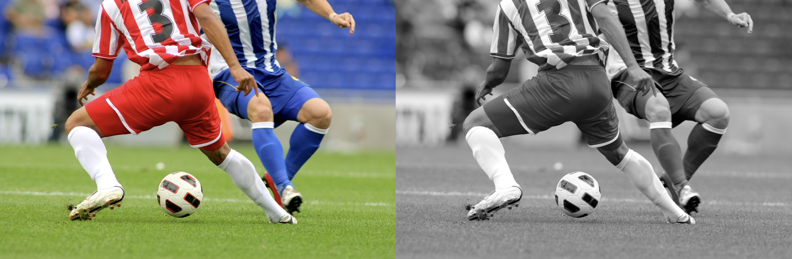
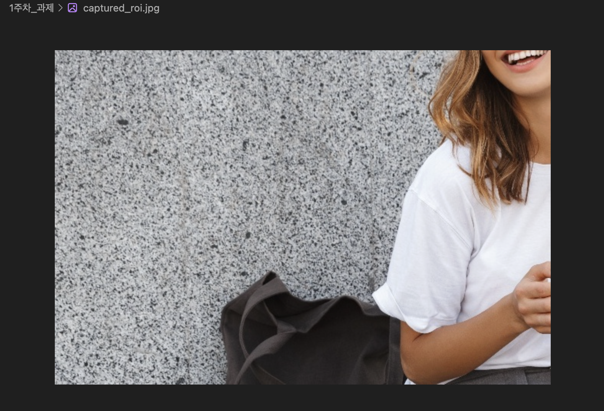

# 📷 OpenCV 1주차 과제 정리

본 저장소는 컴퓨터비전 OpenCV 1주차 과제(1~3)를 수행한 결과를 담고 있습니다.

---

## 📌 과제 1: 원본 이미지와 흑백(Grayscale) 이미지 동시 출력
`01_grayscale_view.py`
원본 컬러 이미지를 불러온 뒤, 이를 흑백 이미지로 변환하고 두 이미지를 나란히 합쳐서 하나의 창에 출력하는 과제입니다.

### 📝 전체 코드
```python
import cv2 as cv
import numpy as np
import sys

# 1. 이미지 로드
img = cv.imread('soccer.jpg') 

if img is None:
    sys.exit('파일을 찾을 수 없습니다.')

# 2. 이미지를 그레이스케일(흑백)로 변환
gray = cv.cvtColor(img, cv.COLOR_BGR2GRAY)

# 3. 흑백 이미지를 다시 3채널(BGR) 형태로 변환
gray_3channel = cv.cvtColor(gray, cv.COLOR_GRAY2BGR)

# 4. 원본 사진과 흑백 사진 가로로 이어붙이기
res = np.hstack((img, gray_3channel))

# 5. 결과 화면 출력 
cv.imshow('Original and Grayscale', res)
cv.waitKey(0) 
cv.destroyAllWindows()
```

### 🔑 주요 코드 및 설명
```python
gray = cv.cvtColor(img, cv.COLOR_BGR2GRAY)
gray_3channel = cv.cvtColor(gray, cv.COLOR_GRAY2BGR)
res = np.hstack((img, gray_3channel))
```
* **`cv.cvtColor`**: 이미지의 색상 공간을 변환하는 강력한 함수입니다. `COLOR_BGR2GRAY`를 통해 3채널의 컬러 이미지를 1채널 흑백 이미지로 변환합니다.
* **`cv.COLOR_GRAY2BGR`**: 흑백(1채널) 사진을 원본(3채널) 사진과 나란히 이어붙이기 위해서는 두 이미지의 채널 차원 형태가 동일해야 합니다. 따라서 1채널 흑백 사진을 다시 껍데기만 3채널 형태로 늘려주는 역할을 합니다.
* **`np.hstack`**: Numpy 배열로 이루어진 두 이미지를 가로축(수평) 방향으로 이어 붙여 하나의 거대한 배열(이미지)로 만듭니다.

### 🖥 실행 결과 화면


---

## 📌 과제 2: 마우스 이벤트로 그림판 만들기
`02_painter_brush.py`
OpenCV가 제공하는 마우스 이벤트를 활용하여, 마우스를 클릭하고 드래그하면 화면에 원(붓)이 그려지며 `+`, `-` 키보드로 붓의 크기를 조절할 수 있는 간단한 그림판을 만드는 과제입니다.

### 📝 전체 코드
```python
import cv2 as cv
import sys
import numpy as np

img = np.ones((500, 600, 3), np.uint8) * 255 
brush_size = 5 
L_color = (255, 0, 0) # 파란색
R_color = (0, 0, 255) # 빨간색

def draw(event, x, y, flags, param):
    global brush_size
    
    # 1) 좌클릭 및 로 클릭한 채로 이동할 때
    if event == cv.EVENT_LBUTTONDOWN or (event == cv.EVENT_MOUSEMOVE and flags == cv.EVENT_FLAG_LBUTTON):
        cv.circle(img, (x, y), brush_size, L_color, -1)
        
    # 2) 우클릭 및 우 클릭한 채로 이동할 때
    elif event == cv.EVENT_RBUTTONDOWN or (event == cv.EVENT_MOUSEMOVE and flags == cv.EVENT_FLAG_RBUTTON):
        cv.circle(img, (x, y), brush_size, R_color, -1)
    
    cv.imshow('Painting', img)

cv.namedWindow('Painting')
cv.setMouseCallback('Painting', draw)

while True:
    cv.imshow('Painting', img) 
    key = cv.waitKey(1) & 0xFF 
    
    if key == ord('q'): 
        break
    elif key == ord('+') or key == ord('='): 
        brush_size = min(15, brush_size + 1) 
    elif key == ord('-') or key == ord('_'): 
        brush_size = max(1, brush_size - 1)  

cv.destroyAllWindows()
```

### 🔑 주요 코드 및 설명
```python
cv.namedWindow('Painting')
cv.setMouseCallback('Painting', draw)

# draw 함수 내부의 마우스 상태 검사
if event == cv.EVENT_LBUTTONDOWN or (event == cv.EVENT_MOUSEMOVE and flags == cv.EVENT_FLAG_LBUTTON):
    cv.circle(img, (x, y), brush_size, L_color, -1)
```
* **`cv.setMouseCallback`**: 특정 창('Painting') 안에서 마우스 움직임이나 클릭이 감지될 때마다, 내가 지정한 함수(`draw`)를 자동으로 호출하도록 연결시켜주는 역할을 합니다.
* **`event`와 `flags`를 이용한 드래그 감지**: 마우스가 그냥 이동하는 것(`EVENT_MOUSEMOVE`)과 알트/컨트롤/마우스버튼 등의 상태 정보가 담긴 `flags`(`EVENT_FLAG_LBUTTON`: 좌클릭이 유지되고 있음)를 조합하여 '드래그(Drag)' 동작을 구현했습니다.
* **`cv.circle`**: 화면의 `(x, y)` 좌표에 반지름이 `brush_size`인 원을 그립니다. 두께 자리에 들어간 `-1`은 원의 내부를 빈틈없이 꽉 채워 그리겠다는 뜻입니다.

### 🖥 실행 결과 화면


---

## 📌 과제 3: 마우스 드래그를 이용한 관심영역(ROI) 추출 및 저장
`03_roi_selector.py`
사진 위에서 원하는 영역을 마우스로 드래그해 빨간색 테두리로 표시하고, 해당 부분만을 잘라내(Cropping) 별도의 창으로 띄운 뒤 파일로 저장까지 할 수 있는 기능입니다.

### 📝 전체 코드
```python
import cv2 as cv
import sys

img = cv.imread('girl_laughing.jpg') 

if img is None:
    sys.exit('파일을 찾을 수 없습니다. 경로를 확인하세요.')

original_img = img.copy()

ix, iy = -1, -1      
drawing = False      
roi = None           

def select_roi(event, x, y, flags, param):
    global ix, iy, drawing, img, roi
    
    if event == cv.EVENT_LBUTTONDOWN:
        drawing = True
        ix, iy = x, y 
        
    elif event == cv.EVENT_LBUTTONUP:
        drawing = False
        cv.rectangle(img, (ix, iy), (x, y), (0, 0, 255), 2)
        
        # 이미지 슬라이싱
        roi = original_img[min(iy, y):max(iy, y), min(ix, x):max(ix, x)]
        
        if roi.size > 0:
            cv.imshow('Cropped ROI', roi)

cv.namedWindow('Select ROI')
cv.setMouseCallback('Select ROI', select_roi)

while True:
    cv.imshow('Select ROI', img) 
    key = cv.waitKey(1) & 0xFF 
    
    if key == ord('r'):
        img = original_img.copy()     
        roi = None                    
        if cv.getWindowProperty('Cropped ROI', 0) >= 0: 
            cv.destroyWindow('Cropped ROI')            

    elif key == ord('s'):
        if roi is not None and roi.size > 0:
            cv.imwrite('captured_roi.jpg', roi)

    elif key == ord('q'):
        break

cv.destroyAllWindows()
```

### 🔑 주요 코드 및 설명
```python
# 사각형 그리기
cv.rectangle(img, (ix, iy), (x, y), (0, 0, 255), 2)

# Numpy 배열 슬라이싱을 통한 이미지 크롭
roi = original_img[min(iy, y):max(iy, y), min(ix, x):max(ix, x)]

# 파일 저장
cv.imwrite('captured_roi.jpg', roi)
```
* **`cv.rectangle`**: 시작점 `(ix, iy)`부터 현재 마우스를 뗀 점 `(x, y)`까지 이어지는 직사각형을 그립니다. `(0, 0, 255)`는 BGR 기준 빨간색을 의미합니다.
* **`Numpy 이미지 슬라이싱`**: OpenCV의 이미지는 Numpy의 다차원 행렬(Matrix) 구조를 그대로 사용합니다. 따라서 `배열[y축시작:y축끝, x축시작:x축끝]` 형태로 원하는 부분을 뚝 떼어낼 수 있습니다. `min/max`를 사용해 사용자가 오른쪽 위에서 왼쪽 아래 등 역방향으로 드래그를 하더라도 인덱스 에러가 발생하지 않도록 강제 교정하여 잘라냅니다.
* **`cv.imwrite`**: 슬라이싱 되어 `roi` 변수에 담긴 이미지 데이타 배열을 실제 `.jpg` 같은 그림 파일 형태로 컴퓨터(하드디스크)에 저장시키는 함수입니다.

### 🖥 실행 결과 화면



