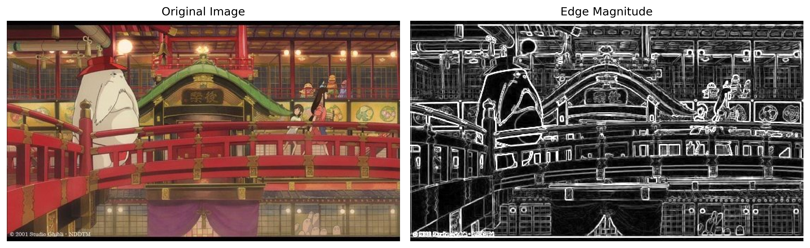
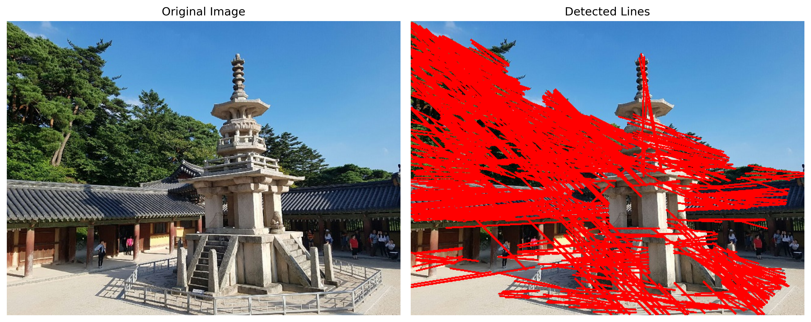
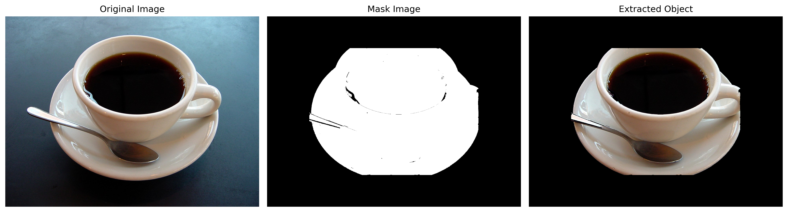

# 📷 OpenCV 3주차 과제 정리

본 저장소는 컴퓨터비전 OpenCV 3주차 과제(1~3)를 수행한 결과를 담고 있습니다.

---

## 📌 과제 1: 소벨 에지 검출 및 결과 시각화
`01.SobelEdge.py`  
이미지를 그레이스케일로 변환한 후, Sobel 필터를 사용하여 x축과 y축 방향의 에지를 검출하고, 이를 바탕으로 에지 강도 이미지를 계산하여 시각화하는 과제입니다.

### 📝 전체 코드
```python
import cv2 as cv # OpenCV 라이브러리를 cv라는 이름으로 불러옵니다.
import numpy as np # 수치 연산을 위한 numpy 라이브러리를 np라는 이름으로 불러옵니다.
import matplotlib.pyplot as plt # 그래프나 이미지를 시각화하기 위해 matplotlib의 pyplot을 불러옵니다.
import os # 운영체제의 파일 및 디렉토리 관리 기능을 사용하기 위해 os 라이브러리를 불러옵니다.

# 현재 실행 중인 파일의 절대 경로를 바탕으로 폴더 경로를 지정합니다.
base_dir = os.path.dirname(os.path.abspath(__file__))
# 사용할 이미지(edgeDetectionImage.jpg)의 최종 절대 경로를 결합하여 문자열로 생성합니다.
image_path = os.path.join(base_dir, "images/edgeDetectionImage.jpg")

# 지정된 경로의 이미지 파일을 BGR 형식의 픽셀 배열로 읽어옵니다.
img = cv.imread(image_path)
# 만약 이미지를 정상적으로 불러오지 못해 img 변수가 None이라면,
if img is None:
    # 에러 메시지를 출력합니다.
    print(f"Error: Could not read image at {image_path}")
    # 프로그램을 강제 종료합니다.
    exit()

# Matplotlib으로 띄우기 위해 BGR 색상 배열을 RGB 색상 공간으로 변환합니다.
img_rgb = cv.cvtColor(img, cv.COLOR_BGR2RGB)

# 1. 이미지를 그레이스케일로 변환
# 그레이스케일(흑백) 형태로 변경하여 연산 속도를 높이고 노이즈 처리를 수월하게 합니다.
gray = cv.cvtColor(img, cv.COLOR_BGR2GRAY)

# 2. Sobel 필터를 사용하여 x축과 y축 방향의 에지를 검출
# 가로(x축) 방향 미분을 수행하여 수직선 에지를 찾습니다 (CV_64F로 데이터 손실 방지, 커널사이즈 3)
sobel_x = cv.Sobel(gray, cv.CV_64F, 1, 0, ksize=3)
# 세로(y축) 방향 미분을 수행하여 수평선 에지를 찾습니다 (커널사이즈 3)
sobel_y = cv.Sobel(gray, cv.CV_64F, 0, 1, ksize=3)

# 3. 에지 강도 계산
# x축 방향 및 y축 방향의 기울기 벡터를 결합해 최종적인 에지 강도를 계산합니다.
magnitude = cv.magnitude(sobel_x, sobel_y)

# 4. 에지 강도 이미지를 시각화하기 위해 uint8로 변환
# 64비트 실수형을 절대값을 취하고 0~255 사이 8비트 정수형(uint8)으로 변환해 화면 표시에 적합하게 만듭니다.
magnitude = cv.convertScaleAbs(magnitude)

# 5. 결과 시각화 (원본 이미지와 에지 강도 이미지 나란히 출력)
# 가로 12인치, 세로 6인치 크기로 새로운 도화지(Figure) 객체를 생성합니다.
plt.figure(figsize=(12, 6))

# 1행 2열의 구조 중 1번째 공간에 그래프를 설정합니다.
plt.subplot(1, 2, 1)
# 원본 색상 변환 이미지(RGB)를 화면에 그립니다.
plt.imshow(img_rgb)
# 해당 서브플롯의 제목을 'Original Image'로 설정합니다.
plt.title('Original Image')
# 그림 주변의 축(x, y 눈금자)을 숨깁니다.
plt.axis('off')

# 1행 2열의 구조 중 2번째 공간에 그래프를 설정합니다.
plt.subplot(1, 2, 2)
# 에지 강도를 구한 영상 값을 흑백 맵(gray)으로 표시합니다.
plt.imshow(magnitude, cmap='gray')
# 해당 서브플롯의 제목을 'Edge Magnitude'로 설정합니다.
plt.title('Edge Magnitude')
# 그림 주변의 축을 숨깁니다.
plt.axis('off')

# 그래프의 여백을 촘촘하게(레이아웃 침범 방지) 자동 조정합니다.
plt.tight_layout()
# 완성된 Matplotlib 이미지를 컴퓨터에 '과제1_결과.png'라는 이름으로 잘리지 않게 저장합니다.
plt.savefig('과제1_결과.png', dpi=300, bbox_inches='tight')
# 열려있는 플롯(Plot) 창과 관련된 메모리를 안전하게 소멸시킵니다.
plt.close()
```

### 🔑 주요 코드 및 설명
```python
# Sobel 필터를 사용하여 x축, y축 에지 검출 (ksize=3 설정)
sobel_x = cv.Sobel(gray, cv.CV_64F, 1, 0, ksize=3)
sobel_y = cv.Sobel(gray, cv.CV_64F, 0, 1, ksize=3)

# 에지 강도 계산 및 uint8로 변환 설정
magnitude = cv.magnitude(sobel_x, sobel_y)
magnitude = cv.convertScaleAbs(magnitude)
```
* **`cv.Sobel`**: 소벨 마스크를 사용하여 이미지상에서 미분값을 구해 에지를 찾아냅니다. 데이터 손실을 방지하기 위해 `CV_64F` 정밀도를 사용합니다.
* **`cv.magnitude`**: x축 방향과 y축 방향 벡터들의 크기를 결합해, 전체적인 에지의 강도를 계산합니다.
* **`cv.convertScaleAbs`**: 계산된 결과를 출력과 시각화가 가능하도록 절대값을 취해 `uint8` 형식(0~255 범위의 픽셀값)으로 변환해줍니다.

### 🖥 실행 결과 화면


---

## 📌 과제 2: 캐니 에지 및 허프 변환을 이용한 직선 검출
`02.CannyHough.py`  
이미지에 캐니(Canny) 에지 검출을 사용하여 에지 맵을 생성한 후, 허프 변환(Hough Transform)을 응용해 직선 성분을 찾아 원본 이미지에 그려주는 과제입니다.

### 📝 전체 코드
```python
import cv2 as cv # OpenCV 라이브러리를 cv라는 이름으로 불러옵니다.
import numpy as np # 수치 연산을 위한 numpy 라이브러리를 np라는 이름으로 불러옵니다.
import matplotlib.pyplot as plt # 시각화를 위한 matplotlib의 pyplot 기능을 불러옵니다.
import os # 파일 및 폴더 경로 작업을 위해 os 파이썬 내장 라이브러리를 불러옵니다.

# 현재 디렉토리의 절대 경로를 계산하여 base_dir에 저장합니다.
base_dir = os.path.dirname(os.path.abspath(__file__))
# 불러올 사진 파일(dabo.jpg)의 올바른 통합 경로를 문자열로 만듭니다.
image_path = os.path.join(base_dir, "images/dabo.jpg")

# 설정된 경로의 원본 이미지를 BGR 형태로 디코딩하여 numpy 배열로 읽어 들입니다.
img = cv.imread(image_path)
# 파일 인식이나 경로 설정의 문제로 이미지가 불러와지지 않은 경우
if img is None:
    # 사용자에게 안내 메시지를 콘솔로 출력합니다.
    print(f"Error: Could not read image at {image_path}")
    # 프로그램을 즉시 종료합니다.
    exit()

# Matplotlib의 정상적 출력 처리를 위해 BGR 순서를 RGB 순서로 배열 변환합니다.
img_rgb = cv.cvtColor(img, cv.COLOR_BGR2RGB)
# 추후 붉은색 직선을 그려줄 도화지용 원본 이미지를 메모리에 미리 복사해 둡니다.
img_line = img.copy()

# 1. 이미지를 그레이스케일로 변환
# 3채널의 색상값을 가진 이미지를 1채널 흑백 이미지로 바꿔 연산 부하를 크게 줄입니다.
gray = cv.cvtColor(img, cv.COLOR_BGR2GRAY)

# 2. Canny 에지 검출을 사용하여 에지 맵 생성 
# 최소 임계값(100), 최대 임계값(200)을 넘어가는 얇고 선명한 테두리를 흰색 선으로 뽑아냅니다.
edges = cv.Canny(gray, threshold1=100, threshold2=200)

# 3. 허프 변환을 사용하여 이미지에서 직선 검출
# 확률적 허프 변환(HoughLinesP)으로, 간격 허용도(maxLineGap)와 최소 길이(minLineLength)에 맞는 직선의 좌표들을 얻어옵니다.
lines = cv.HoughLinesP(edges, rho=1, theta=np.pi/180, threshold=100, minLineLength=50, maxLineGap=10)

# 4. 검출된 직선을 원본 이미지에서 빨간색으로 표시
# 직선이 단 1개라도 배열 데이터로 무사히 검출되었다면,
if lines is not None:
    # 이중 리스트 형태(lines) 안의 각 직선의 x,y 좌표 배열들을 순회 반복합니다.
    for line in lines:
        # 직선 1개의 (시작 x, 시작 y, 끝 x, 끝 y) 값을 언패킹해 가져옵니다.
        x1, y1, x2, y2 = line[0]
        # 미리 복제해 둔 사진 도화지(img_line)에 두께가 2 픽셀인 (0=B, 0=G, 255=R) 빨간 직선을 긋습니다.
        cv.line(img_line, (x1, y1), (x2, y2), (0, 0, 255), 2)

# 화면에 직선 그려진 걸 표출해주기 위해 이미지의 포맷을 RGB로 한 번 다시 변경합니다.
img_line_rgb = cv.cvtColor(img_line, cv.COLOR_BGR2RGB)

# 5. 결과 시각화
# 좌우로 시원하게 배치하기 위해 가로 12, 세로 6인치 크기 설정된 레이아웃 창을 엽니다.
plt.figure(figsize=(12, 6))

# 1행 2열로 화면을 분할하고 그중 좌측에 해당하는 플롯 공간을 택합니다.
plt.subplot(1, 2, 1)
# 아무 선도 없어 깨끗한 원본 RGB 이미지를 그림판에 그립니다.
plt.imshow(img_rgb)
# 서브플롯 영역 최상단에 'Original Image' 영문 제목을 달아줍니다.
plt.title('Original Image')
# 불필요한 테두리 축 정보들을 제거하여 깔끔하게 만듭니다.
plt.axis('off')

# 우측 영역 두 번째 플롯을 지목합니다.
plt.subplot(1, 2, 2)
# 앞서 빨간 선을 새롭게 그린 이미지 버전을 배열로 밀어 넣습니다.
plt.imshow(img_line_rgb)
# 서브플롯의 제목(title)으로 'Detected Lines'를 지정합니다.
plt.title('Detected Lines')
# 눈금과 축 라벨을 시각화 과정에서 보이지 않도록 없앱니다.
plt.axis('off')

# 화면 구성을 자율적으로 정돈하여 두 이미지의 겹침을 방지합니다.
plt.tight_layout()
# 작성한 플로팅 이미지 전체를 300 해상도(dpi)를 가진 고품질 png 사진 파일로 데스크탑에 다운로드 저장합니다.
plt.savefig('과제2_결과.png', dpi=300, bbox_inches='tight')
# 사용 완료 후 즉시 내부 도화지를 닫고 리소스 자원 메모리를 반환 및 종료합니다.
plt.close()
```

### 🔑 주요 코드 및 설명
```python
# Canny 에지 검출 (threshold1, threshold2 파라미터 적용)
edges = cv.Canny(gray, threshold1=100, threshold2=200)

# 허프 변환을 통한 직선 성분 추출
lines = cv.HoughLinesP(edges, rho=1, theta=np.pi/180, threshold=100, minLineLength=50, maxLineGap=10)
```
* **`cv.Canny`**: 윤곽선을 깔끔하게 한 픽셀의 두께로 검출해 내는 함수입니다. 임계값(Threshold1, 2) 설정을 통해 확실한 강력한 경계만 추출하도록 조정합니다.
* **`cv.HoughLinesP`**: 확률적 허프 변환 알고리즘으로 윤곽선 안에서 직선 성분을 빠르게 찾아 좌표를 도출합니다. `minLineLength`(최소 선 길이)과 `maxLineGap`(끊어진 선 허용 오차) 등을 적절하게 지정해서 좋은 품질의 직선들을 뽑아냅니다.
* **`cv.line`**: 검출된 좌표를 따라 영상 위에 빨간색(`(0, 0, 255)`)으로 두께가 2인 선을 실제로 그려주는 기능입니다.

### 🖥 실행 결과 화면


---

## 📌 과제 3: GrabCut을 이용한 대화식 영역 분할 및 객체 추출
`03.GrabCut.py`  
사진 속에서 사용자가 지정한 사각형 영역을 바탕으로 GrabCut 알고리즘을 사용해 불필요한 배경과 타겟 객체를 분리(Segmentation)하여 주요 피사체만 깔끔하게 추출해 내는 과제입니다.

### 📝 전체 코드
```python
import cv2 as cv # 컴퓨터 비전 처리를 위한 필수 라이브러리 OpenCV를 임포트합니다.
import numpy as np # 빠르고 강력한 다차원 배열 연산을 돕는 numpy를 불러옵니다.
import matplotlib.pyplot as plt # 차트나 사진 시각화의 정석인 matplotlib 기능들을 가져옵니다.
import os # 파일 및 폴더 탐색을 위한 운영 체제 라이브러리 os를 로드합니다.

# 이 코드를 돌리고 있는 파이썬 파일 기준 절대경로를 구하여 폴더명만 담습니다.
base_dir = os.path.dirname(os.path.abspath(__file__))
# 3번째 과제 사진인 'coffee cup.JPG'의 완벽한 맥 환경 파일 경로를 디렉토리명과 합쳐서 반환합니다.
image_path = os.path.join(base_dir, "images/coffee cup.JPG")

# 지정된 경로의 이미지 파일을 BGR 형식의 픽셀 배열로 읽어옵니다.
img = cv.imread(image_path)
# 만약 이미지를 정상적으로 불러오지 못해 img 변수가 None이라면,
if img is None:
    # 에러 메시지를 출력합니다.
    print(f"Error: Could not read image at {image_path}")
    # 프로그램을 강제 종료합니다.
    exit()

# 화면상에 왜곡된 푸릇푸릇한 색상을 방지하기 위해 일반적 포맷인 RGB로 일치화시킵니다.
img_rgb = cv.cvtColor(img, cv.COLOR_BGR2RGB)

# 1. 초기 마스크 및 배경 모델, 전경 모델 생성
# 원본 이미지의 가로세로 해상도(크기)에 부합하는 빈 공간인 0(uint8) 배열의 블랙 마스크를 창조해냅니다.
mask = np.zeros(img.shape[:2], np.uint8)
# GMM 방식 알고리즘이 내부적으로 학습할 배경(Bgd) 파라미터 보관용 빈 실수 배열 행렬을 만듭니다.
bgdModel = np.zeros((1, 65), np.float64)
# GMM 방식의 객체 혹은 전경(Fgd) 상태와 분포 가중치를 저장할 65차원 공간의 파라미터 모델을 0으로 꽉 채웁니다.
fgdModel = np.zeros((1, 65), np.float64)

# 2. 초기 사각형 영역은 (x, y, width, height) 형식으로 설정
# height(높이)와 width(폭) 정보를 슬라이싱을 통해 tuple 형태로 나누어 받습니다.
h, w = img.shape[:2]
# 커피 컵 영역을 적절하게 감싸줄 포착 사각형(배경은 쳐내고 객체만 들어올) 크기 값을 설정 및 지정합니다.
rect = (w // 6, h // 6, w * 2 // 3, h * 2 // 3)

# 3. cv.grabCut()를 사용하여 대화식 분할 알고리즘을 수행
# 이 사각형(rect)을 초기 조건으로 5번의 반복 연산(iterCount)동안 통계 학습 모델이 작동하며 배경을 분할합니다.
cv.grabCut(img, mask, rect, bgdModel, fgdModel, iterCount=5, mode=cv.GC_INIT_WITH_RECT)

# 4. 마스크를 사용하여 이미지 복원 및 원본 이미지에서 배경 제거
# GC_BGD(0), GC_PR_BGD(2) 등 지워질 뒷배경(0) 요소를 제외한 전경 부분만 1의 값인 uint8 이진 형태로 재설정합니다.
mask2 = np.where((mask == cv.GC_BGD) | (mask == cv.GC_PR_BGD), 0, 1).astype('uint8')

# 이렇게 완성된 이진 흑백 마스크 평면 공간을 3차원(`newaxis`)으로 늘려 곱셈하면, 원본 이미지에서 0인 뒷배경은 검은색(삭제)으로 변합니다.
img_extracted = img * mask2[:, :, np.newaxis]
# 결과를 matplotlib을 통해 표시할 수 있게끔 BGR을 RGB로 색 조합 형식을 바꿔줍니다.
img_extracted_rgb = cv.cvtColor(img_extracted, cv.COLOR_BGR2RGB)

# 5. 결과 시각화
# 여러 장을 옆으로 길게 뽑아내기 위해 15x6 비율의 넓직한 판을 깝니다.
plt.figure(figsize=(15, 6))

# 3개의 구획 중 제일 첫 번째 자리를 준비합니다.
plt.subplot(1, 3, 1)
# 필터링 단계를 안 거친 순수 첫 원본 이미지 자체를 묘사합니다.
plt.imshow(img_rgb)
# 사용자가 이 그림이 뭐였는지 알게 상단 제목으로 달아줍니다.
plt.title('Original Image')
# 좌표축 따위의 선들이 분위기를 해치지 않게 가립니다.
plt.axis('off')

# 정중앙의 2번째 서브플롯 영역으로 이동합니다.
plt.subplot(1, 3, 2)
# 전경이 하얗게(1), 원치 않는 배경부분이 새까맣게(0) 걸러진 이진 분할 결과 마스크 맵을 도식화합니다.
plt.imshow(mask2, cmap='gray')
# 마찬가지로 이것이 'Mask Image' 란 영문 타이틀을 작성해 부착합니다.
plt.title('Mask Image')
# 불필요한 x축과 y축 숫자를 안 보이게 끕니다.
plt.axis('off')

# 가장 오른쪽 끄트머리에 세 번째 플롯을 그립니다.
plt.subplot(1, 3, 3)
# 배경이 전부 지워져서 커피 컵 객체 피사체만 남은 RGB 분할 결과 사진을 나타냅니다.
plt.imshow(img_extracted_rgb)
# 사진 위에다 'Extracted Object'라고 이름표를 적어줍니다.
plt.title('Extracted Object')
# 옆의 그림들처럼 경계면 축 텍스트 표시와 라인을 지워버립니다.
plt.axis('off')

# 화면 요소들을 딱딱 포개어 정렬시키고 공백을 자동으로 적절하게 나눠줍니다.
plt.tight_layout()
# 현재 시점까지 그려낸 플롯 도표 객체를 물리적인 파일시스템에 이미지 확장자인 png 포맷으로 저장/생성시킵니다.
plt.savefig('과제3_결과.png', dpi=300, bbox_inches='tight')
# 해당 렌더링된 객체를 프로그램 메모리 상 클리어하게 해제하고 지워 안정화를 도모합니다.
plt.close()
```

### 🔑 주요 코드 및 설명
```python
# GrabCut 알고리즘 적용 (반복 횟수 5회)
cv.grabCut(img, mask, rect, bgdModel, fgdModel, iterCount=5, mode=cv.GC_INIT_WITH_RECT)

# 추출된 mask 내부의 노이즈 정보 보정 분할
mask2 = np.where((mask == cv.GC_BGD) | (mask == cv.GC_PR_BGD), 0, 1).astype('uint8')
img_extracted = img * mask2[:, :, np.newaxis]
```
* **`cv.grabCut`**: 사각형(`rect`) 안에서 색상 및 질감 분포를 통계적으로 학습시켜 객체(전경)와 배경을 분리하는 모델 도출 알고리즘입니다. 내부적으로 가우스 혼합 모델(GMM) 파라미터들을 `bgdModel`, `fgdModel`로 학습하며 저장합니다.
* **`np.where`**: 반환된 1차 마스크 영역 안에는 확실한 배경, 아마도 배경, 확실한 전경, 아마도 전경 값이 섞여있습니다. 해당 함수를 써서 배경으로 지목된 부분들은 0, 전경은 1이라는 두 가지 이진(Binary) 마스크 값으로 확정 짓습니다.
* **`img * mask2`**: 완성된 0과 1로 된 흑백 마스크 평면 공간을 3차원(`np.newaxis`)으로 늘려 곱셈하면, 원본 이미지에서 0인 뒷배경은 모두 검은색(삭제)으로 변하고 전경 객체만 살아남게 됩니다.

### 🖥 실행 결과 화면

