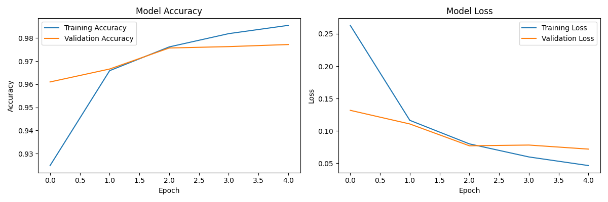
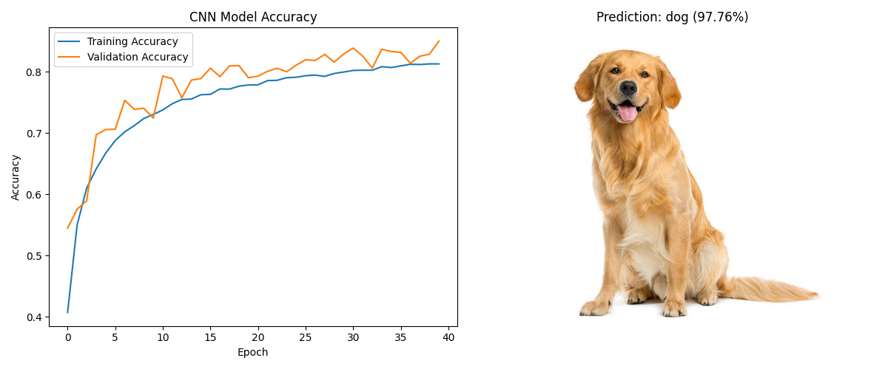

# 📷 OpenCV 5주차 과제 정리

본 저장소는 컴퓨터비전 OpenCV 5주차 과제(1~2)를 수행한 결과를 담고 있습니다.

---

## 📌 과제 1: 간단한 이미지 분류기 구현 (MNIST)
`01_mnist_classification.py`
손글씨 숫자 이미지(MNIST 데이터셋)를 이용하여 TensorFlow Keras 기반의 간단한 이미지 분류기를 구현하고 학습하는 과제입니다.

### 📝 전체 코드
```python
import tensorflow as tf
from tensorflow.keras.models import Sequential
from tensorflow.keras.layers import Dense, Flatten
import matplotlib.pyplot as plt
import os

# results 폴더 확인
os.makedirs('results', exist_ok=True)

# 1. MNIST 데이터셋 로드
print("MNIST 데이터셋 로드 중...")
mnist = tf.keras.datasets.mnist
(x_train, y_train), (x_test, y_test) = mnist.load_data()

# 2. 데이터 전처리 (0~1 정규화)
x_train, x_test = x_train / 255.0, x_test / 255.0

# 3. 모델 구축
model = Sequential([
    Flatten(input_shape=(28, 28)),      # 28x28 2차원 배열을 1차원 배열로 평탄화
    Dense(128, activation='relu'),      # 128개의 노드를 가진 은닉층
    Dense(10, activation='softmax')     # 10개의 클래스(0~9)로 출력
])

# 4. 모델 컴파일
model.compile(optimizer='adam',
              loss='sparse_categorical_crossentropy',
              metrics=['accuracy'])

# 5. 모델 훈련
print("모델 훈련 시작...")
history = model.fit(x_train, y_train, epochs=5, validation_data=(x_test, y_test))

# 6. 모델 평가
print("\n모델 평가:")
test_loss, test_acc = model.evaluate(x_test, y_test, verbose=2)
print(f"테스트 정확도: {test_acc:.4f}")

# 7. 결과 시각화 및 저장
plt.figure(figsize=(12, 4))
plt.subplot(1, 2, 1)
plt.plot(history.history['accuracy'], label='Training Accuracy')
plt.plot(history.history['val_accuracy'], label='Validation Accuracy')
plt.title('Model Accuracy')
plt.xlabel('Epoch')
plt.ylabel('Accuracy')
plt.legend()

plt.subplot(1, 2, 2)
plt.plot(history.history['loss'], label='Training Loss')
plt.plot(history.history['val_loss'], label='Validation Loss')
plt.title('Model Loss')
plt.xlabel('Epoch')
plt.ylabel('Loss')
plt.legend()

plt.tight_layout()
plt.savefig('results/과제1_결과.png')
print("결과 그래프가 'results/과제1_결과.png'에 저장되었습니다.")
```

### 🔑 주요 코드 및 설명
```python
model = Sequential([
    Flatten(input_shape=(28, 28)),
    Dense(128, activation='relu'),
    Dense(10, activation='softmax')
])
```
* **`Flatten`**: 28x28 픽셀 크기의 2차원 이미지를 입력받아 1차원(784) 배열로 평탄화합니다.
* **`Dense`**: 기본적인 인공 신경망 레이어입니다. 128개의 은닉층 노드에는 비선형성을 추가하기 위해 `relu` 활성화 함수를 사용하였고, 최종 출력층은 10개(0~9)의 클래스 확률을 구하기 위해 `softmax` 활성화 함수를 적용하였습니다.

### 🖥 실행 결과 화면


---

## 📌 과제 2: CIFAR-10 데이터셋을 활용한 CNN 모델 구축
`02_cifar10_cnn.py`
CIFAR-10 데이터셋을 활용하여 합성곱 신경망(CNN)을 구축하고, 개(dog.jpg) 이미지를 통해 예측 테스트를 수행하는 과제입니다.

### 📝 전체 코드
```python
import tensorflow as tf
from tensorflow.keras.models import Sequential
from tensorflow.keras.layers import Conv2D, MaxPooling2D, Flatten, Dense
import matplotlib.pyplot as plt
import cv2
import numpy as np
import os

# results 폴더 확인
os.makedirs('results', exist_ok=True)

# 1. CIFAR-10 데이터셋 로드
print("CIFAR-10 데이터셋 로드 중...")
cifar10 = tf.keras.datasets.cifar10
(x_train, y_train), (x_test, y_test) = cifar10.load_data()

# CIFAR-10 클래스 이름 (예측 결과 확인용)
class_names = ['airplane', 'automobile', 'bird', 'cat', 'deer',
               'dog', 'frog', 'horse', 'ship', 'truck']

# 2. 데이터 전처리 (0~1 범위로 정규화)
x_train, x_test = x_train / 255.0, x_test / 255.0

# 3. CNN 모델 설계
model = Sequential([
    Conv2D(32, (3, 3), activation='relu', input_shape=(32, 32, 3)),
    MaxPooling2D((2, 2)),
    Conv2D(64, (3, 3), activation='relu'),
    MaxPooling2D((2, 2)),
    Conv2D(64, (3, 3), activation='relu'),
    Flatten(),
    Dense(64, activation='relu'),
    Dense(10, activation='softmax')
])

# 4. 모델 훈련 설정 (컴파일)
model.compile(optimizer='adam',
              loss='sparse_categorical_crossentropy',
              metrics=['accuracy'])

# 5. 모델 훈련
print("CNN 모델 훈련 시작...")
history = model.fit(x_train, y_train, epochs=10, validation_data=(x_test, y_test))

# 6. 모델 성능 평가
print("\n모델 평가:")
test_loss, test_acc = model.evaluate(x_test, y_test, verbose=2)
print(f"테스트 정확도: {test_acc:.4f}")

# 7. 테스트 이미지에 대한 예측 수행 (dog.jpg)
img_path = 'image/dog.jpg'
if os.path.exists(img_path):
    img = cv2.imread(img_path)
    img_rgb = cv2.cvtColor(img, cv2.COLOR_BGR2RGB)
    
    # 모델 입력 크기에 맞게 이미지 리사이즈 (32x32)
    img_resized = cv2.resize(img_rgb, (32, 32))
    
    # 정규화 및 배치 차원 추가
    img_input = np.expand_dims(img_resized / 255.0, axis=0)
    
    # 예측 수행
    predictions = model.predict(img_input)
    predicted_class_idx = np.argmax(predictions)
    predicted_class = class_names[predicted_class_idx]
    confidence = np.max(predictions) * 100
    
    print(f"\n예측 결과: {predicted_class} (정확도: {confidence:.2f}%)")
    
    # 8. 결과 시각화 및 저장
    plt.figure(figsize=(12, 5))
    
    plt.subplot(1, 2, 1)
    plt.plot(history.history['accuracy'], label='Training Accuracy')
    plt.plot(history.history['val_accuracy'], label='Validation Accuracy')
    plt.title('CNN Model Accuracy')
    plt.xlabel('Epoch')
    plt.ylabel('Accuracy')
    plt.legend()
    
    plt.subplot(1, 2, 2)
    plt.imshow(img_rgb)
    plt.title(f"Prediction: {predicted_class} ({confidence:.2f}%)")
    plt.axis('off')
    
    plt.tight_layout()
    plt.savefig('results/과제2_결과.png')
    print("결과 이미지가 'results/과제2_결과.png'에 저장되었습니다.")
```

### 🔑 주요 코드 및 설명
```python
model = Sequential([
    Conv2D(32, (3, 3), activation='relu', input_shape=(32, 32, 3)),
    MaxPooling2D((2, 2)),
    Conv2D(64, (3, 3), activation='relu'),
    MaxPooling2D((2, 2)),
    Conv2D(64, (3, 3), activation='relu'),
    Flatten(),
    ...
])
```
* **`Conv2D`**: 이미지의 특징(Feature)을 추출하기 위해 3x3 크기의 필터(커널)를 돌며 합성곱 연산을 진행합니다. 레이어를 거칠 때마다 채널 수(32->64)를 증가시켜 점차 복잡한 특징들을 학습하게 됩니다.
* **`MaxPooling2D`**: 2x2 사이즈 안에서 가장 큰 값을 추출하여 이미지 크기를 절반으로 줄여가며 핵심적인 특징만 간추려 연산량을 감소시킵니다.
* **데이터 전처리 (정규화)**: 모델의 수렴 속도를 높이고 기울기 폭발/소실을 방지하기 위해 각 픽셀 값을 255.0으로 나누어 `0~1` 범위 내의 스케일로 정규화시켰습니다.

### 🖥 실행 결과 화면

