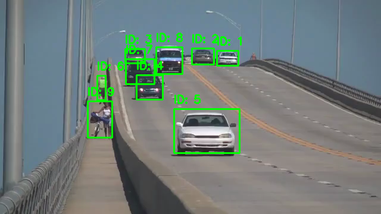
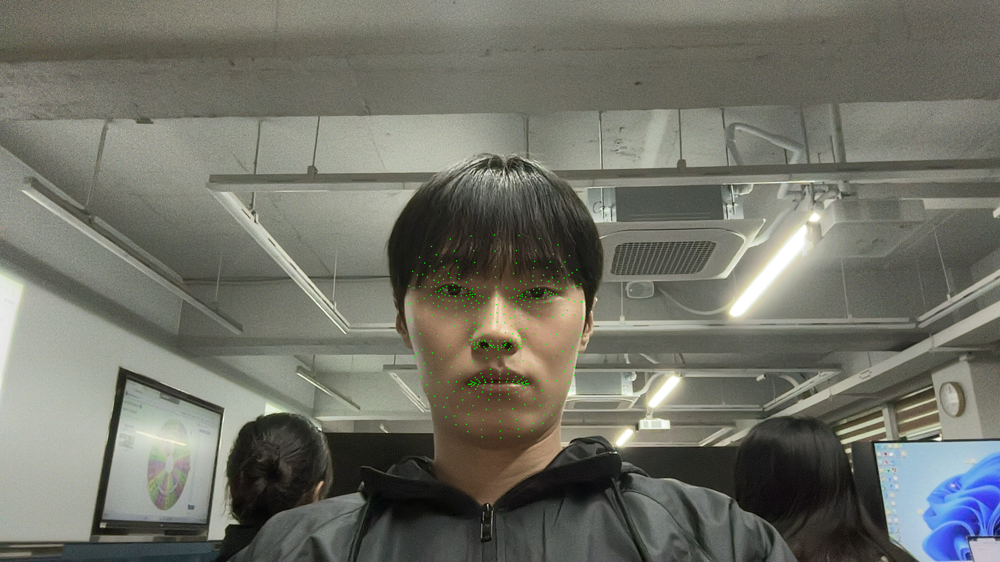

# 📷 OpenCV 6주차 과제 정리

본 저장소는 컴퓨터비전 OpenCV 6주차 실습 과제(1~2)를 수행한 결과를 담고 있습니다. 다중 객체 추적과 얼굴 랜드마크 검출을 구현하였습니다.

---

## 📌 과제 1: SORT 알고리즘을 활용한 다중 객체 추적기 구현
`01_dynamic_vision_01.py`
사전 훈련된 YOLOv3 객체 검출 모델을 사용하여 비디오 프레임 내 객체를 검출하고, SORT 알고리즘을 사용해 각 객체를 실시간으로 추적 및 ID를 시각화하는 프로그램입니다.

### 📝 전체 코드
```python
import cv2 # OpenCV 라이브러리 임포트 (영상 처리 및 컴퓨터 비전 기능 제공)
import numpy as np # 수치 연산을 위한 NumPy 라이브러리 임포트
import os # 운영체제와 상호작용하기 위한 os 모듈 임포트 (파일 경로 처리 등)
from sort import Sort # 객체 추적을 위한 SORT 알고리즘 클래스 임포트

# 현재 스크립트 경로를 기준으로 설정
current_dir = os.path.dirname(os.path.abspath(__file__)) # 현재 실행 중인 스크립트 파일의 절대 경로가 속한 디렉토리 반환
results_dir = os.path.join(current_dir, 'results') # 결과 이미지를 저장할 'results' 폴더 경로 생성
os.makedirs(results_dir, exist_ok=True) # 결과 폴더가 없다면 생성 (exist_ok=True로 이미 존재하면 무시)

# YOLOv3 설정 파일과 가중치 파일 경로
cfg_path = os.path.join(current_dir, 'yolov3.cfg') # YOLOv3 모델의 네트워크 구조 설정 파일 경로
weights_path = os.path.join(current_dir, 'yolov3.weights') # YOLOv3 모델의 가중치 파일 경로

# SORT 추적기 초기화
tracker = Sort() # 객체 추적기 SORT 인스턴스 생성

# YOLO 모델 로드
print("YOLOv3 모델 로딩 중...") # 모델 로딩 시작을 알리는 메시지 출력
net = cv2.dnn.readNetFromDarknet(cfg_path, weights_path) # Darknet 형식의 YOLOv3 모델과 가중치 불러오기
layer_names = net.getLayerNames() # 네트워크의 모든 레이어 이름 가져오기

try: # 최신 OpenCV 버전의 방식 시도
    output_layers = [layer_names[i - 1] for i in net.getUnconnectedOutLayers()] # 출력 레이어(Unconnected 레이어)의 이름 리스트 생성
except: # 에러 발생 시 예전 버전 OpenCV 호환 방식(이전 버전은 리스트 안의 리스트 형태로 반환함)으로 대체
    # 예전 버전 OpenCV 호환용
    output_layers = [layer_names[i[0] - 1] for i in net.getUnconnectedOutLayers()] # 이전 버전 OpenCV를 고려하여 출력 레이어 이름 추출

# 비디오 파일 오픈
video_path = os.path.join(current_dir, 'slow_traffic_small.mp4') # 입력 비디오 파일 경로 설정
cap = cv2.VideoCapture(video_path) # OpenCV 비디오 캡처 객체 생성

if not cap.isOpened(): # 비디오 파일이 정상적으로 열렸는지 확인
    print("비디오 파일을 열 수 없습니다.") # 열 수 없다면 오류 메시지 출력
    exit() # 프로그램 종료

saved_result = False # 첫 번째 프레임 결과 저장을 확인하기 위한 플래그 변수 초기화
print("비디오 처리 시작... (중간에 끄려면 'q' 또는 ESC 키를 누르세요)") # 처리 시작 안내 메시지

while True: # 비디오의 매 프레임별 반복 처리
    ret, frame = cap.read() # 비디오로부터 한 프레임 읽기 (ret는 성공 여부, frame은 이미지 데이터)
    if not ret: # 프레임을 제대로 읽지 못했거나 영상이 끝났으면
        break # 반복문(영상 처리 루프) 탈출
        
    height, width, channels = frame.shape # 현재 프레임 이미지의 세로, 가로, 채널 수 정보 가져오기
    
    # 1. YOLO를 이용한 객체 검출
    # 이미지를 YOLO 네트워크 입력 형태(blob)로 변환: 스케일링(1/255), 크기 조정(416x416), BGR->RGB 변경 안함
    blob = cv2.dnn.blobFromImage(frame, 0.00392, (416, 416), (0, 0, 0), True, crop=False)
    net.setInput(blob) # 변환된 blob을 네트워크 입력으로 설정
    outs = net.forward(output_layers) # 네트워크 순전파를 통해 예측 결과(출력 레이어의 결과) 가져오기
    
    class_ids = [] # 검출된 객체의 클래스 ID들을 저장할 리스트
    confidences = [] # 검출된 객체들의 신뢰도(확률)를 저장할 리스트
    boxes = [] # 검출된 객체들의 경계 상자(바운딩 박스) 좌표를 저장할 리스트
    
    for out in outs: # 각 출력 레이어의 결과 순회
        for detection in out: # 각 검출된 박스 정보 순회
            scores = detection[5:] # 처음 5개 값 제외한 나머지가 각 클래스에 속할 확률(점수) 배열
            class_id = np.argmax(scores) # 가장 확률이 높은 클래스의 인덱스 추출
            confidence = scores[class_id] # 객체에 대한 최대 신뢰도 값 추출
            
            # 신뢰도가 일정 수준 이상인 경우에만 검출 인정
            if confidence > 0.5: # 신뢰도가 0.5보다 큰 객체만 의미있는 검출로 인정
                # 차량(2)이나 사람(0) 등 여러 객체를 원활히 검출하기 위해 임계치만 사용
                center_x = int(detection[0] * width) # 검출된 객체의 중심 x 좌표 계산 (원점 이미지 크기에 비례)
                center_y = int(detection[1] * height) # 검출된 객체의 중심 y 좌표 계산
                w = int(detection[2] * width) # 객체의 실제 너비 계산
                h = int(detection[3] * height) # 객체의 실제 높이 계산
                
                # 경계 상자 좌표 계산
                x = int(center_x - w / 2) # 경계 상자의 좌상단 x 좌표 계산
                y = int(center_y - h / 2) # 경계 상자의 좌상단 y 좌표 계산
                
                boxes.append([x, y, w, h]) # 계산된 경계 상자 [x, y, w, h] 정보를 boxes에 추가
                confidences.append(float(confidence)) # 해당 객체의 신뢰도 값을 추가 (NMS 사용 시 float 형 요구)
                class_ids.append(class_id) # 해당 객체의 클래스 ID를 추가
                
    # NMS(Non-Maximum Suppression)를 통해 겹치는 박스 제거
    # score 임계값 0.5, NMS 임계값 0.4 설정으로 중복되는 경계 상자 제거 후 최종 인덱스 반환
    indexes = cv2.dnn.NMSBoxes(boxes, confidences, 0.5, 0.4)
    
    # 2. 검출 결과를 SORT 추적기 입력 형태로 변환 [x1, y1, x2, y2, score]
    detections = [] # SORT 추적기에 입력할 형태로 좌표를 변환해 임시 저장할 리스트
    if len(indexes) > 0: # NMS를 통과하여 유효한 객체가 1개라도 있는 경우
        for i in indexes.flatten(): # 유효 객체들의 인덱스 순회
            x, y, w, h = boxes[i] # 유효한 박스의 원본 정보 추출
            # SORT 형식에 맞게 좌상단 및 우하단 좌표와 신뢰도로 변환 및 저장
            detections.append([x, y, x + w, y + h, confidences[i]])
            
    # detections 리스트를 NumPy 배열로 변환 (빈 경우 (0,5) 크기의 빈 배열 생성)
    detections = np.array(detections) if len(detections) > 0 else np.empty((0, 5))
    
    # 3. SORT 객체 추적 업데이트
    # 프레임의 바운딩 박스들을 SORT 추적기로 전달하여 업데이트된 ID와 위치(tracks) 반환
    tracks = tracker.update(detections)
    
    # 4. 결과 시각화
    for track in tracks: # 추적기에서 반환된 각각의 추적 정보 순회
        x1, y1, x2, y2, track_id = track.astype(int) # 얻은 위치와 ID를 정수로 형변환
        
        # 상태에 따른 고유 ID 표시 (비디오에 바운딩 박스 그리기)
        cv2.rectangle(frame, (x1, y1), (x2, y2), (0, 255, 0), 2) # 현재 프레임에 객체 경계 상자(녹색, 두께 2) 그리기
        text = f"ID: {track_id}" # 표시할 텍스트에 ID 값 삽입
        cv2.putText(frame, text, (x1, y1 - 10), cv2.FONT_HERSHEY_SIMPLEX, 0.6, (0, 255, 0), 2) # 박스 위에 ID 텍스트 표시
        
    cv2.imshow("SORT Multi-Object Tracking", frame) # 추적 결과가 그려진 프레임을 화면 이름 지정하여 표시
    
    # 첫 프레임 결과를 README 용으로 저장
    if not saved_result and len(tracks) > 0: # 결과 기록 플래그가 거짓이고, 추적된 객체가 있으면
        cv2.imwrite(os.path.join(results_dir, '과제1_결과.png'), frame) # 현재까지 작업된 프레임을 이미지로 처음 1회 추출/저장
        saved_result = True # 저장 완료 상태로 변경
        
    # ESC 키 또는 'q' 키를 누르면 종료
    key = cv2.waitKey(30) & 0xFF # 30ms 동안 키보드 입력 대기
    if key == 27 or key == ord('q'): # ESC키(키코드 27) 혹은 'q'가 입력되면
        print("사용자에 의해 영상이 중간에 종료되었습니다.") # 터미널에 메시지 출력
        break # 루프 종료
        
cap.release() # 비디오 캡처 객체의 리소스 해제
cv2.destroyAllWindows() # OpenCV 기능으로 생성된 모든 화면 창 닫기
```

### 🔑 주요 코드 및 설명
```python
tracker = Sort() # 객체 추적기 SORT 인스턴스 생성
...
detections = np.array(detections) if len(detections) > 0 else np.empty((0, 5)) # detections를 NumPy 배열로 변환
tracks = tracker.update(detections) # 프레임의 바운딩 박스들을 SORT 추적기로 전달하여 업데이트된 ID와 위치 반환
```
* **`Sort()`**: 객체들의 위치를 추적하기 위해 칼만 필터(Kalman Filter)와 헝가리안 매칭 알고리즘을 사용하는 SORT 추적기를 초기화합니다.
* **`tracker.update(detections)`**: 이전 프레임에서 발견된 객체들의 위치 정보와 현재 프레임에서 검출된 객체들을 연관 계산시켜서 동일한 객체는 고유한 `track_id`를 계속 유지하도록 업데이트합니다. YOLOv3만으로는 매 프레임별 객체의 연속성을 알아낼 수 없기에 해당 추적 알고리즘을 사용합니다.

### 🖥 실행 결과 화면


---

## 📌 과제 2: Mediapipe를 활용한 얼굴 랜드마크 추출 및 시각화
`02_dynamic_vision_02.py`
웹캠을 통해 캡쳐되는 실시간 영상에서 Google Mediapipe의 `FaceMesh` 모듈을 사용하여 얼굴의 468개 랜드마크를 추출하고 화면에 실시간 렌더링하는 과제입니다.

### 📝 전체 코드
```python
import cv2 # 영상 관련 처리를 위한 OpenCV 라이브러리 임포트
import mediapipe as mp # 얼굴 랜드마크 추출 등에 사용하는 Mediapipe 라이브러리 임포트
import os # 운영체제 경로 및 디렉토리 관련 처리를 위한 os 모듈 임포트

# 현재 스크립트의 디렉토리를 기준으로 경로 설정
current_dir = os.path.dirname(os.path.abspath(__file__)) # 현재 실행 중인 파일의 절대 디렉토리 경로
results_dir = os.path.join(current_dir, 'results') # 실행 결과 이미지를 저장할 results 폴더 경로 조합
os.makedirs(results_dir, exist_ok=True) # results 폴더가 없다면 생성 (존재해도 에러 발생 방지)

# 1. Mediapipe의 FaceMesh 모듈 초기화
mp_face_mesh = mp.solutions.face_mesh # FaceMesh 모델 모듈 가져오기
face_mesh = mp_face_mesh.FaceMesh( # FaceMesh 객체 인스턴스 생성
    max_num_faces=1, # 영상에서 찾을 최대 얼굴 개수는 1개로 제한
    refine_landmarks=True, # 눈과 입술 주변 등 추가 세부 랜드마크 추출 옵션 활성화
    min_detection_confidence=0.5, # 얼굴로 인식하는 최소 신뢰도 임계값 설정
    min_tracking_confidence=0.5 # 얼굴 추적 임계값 설정 (신뢰도에 미달하면 다시 찾음)
)

# 2. 웹캠 열기
cap = cv2.VideoCapture(0) # 컴퓨터에 연결된 기본 웹캠(0번 인덱스) 연결 포착

if not cap.isOpened(): # 카메라가 성공적으로 열리지 않았다면
    print("웹캠을 찾을 수 없습니다. 비디오 캡처를 사용할 수 없습니다.") # 오류 메시지 출력

saved_result = False # 처음 한 장의 결과 이미지를 기록했는지 여부를 표시하는 플래그
print("얼굴 랜드마크 추출 시작... (중간에 끄려면 'q' 또는 ESC 키를 누르세요)") # 실행 안내 문구 출력

# 3. 실시간 영상 캡처 루프
while cap.isOpened(): # 카메라에서 정상적으로 입력을 받고 있는 동안 반복
    ret, frame = cap.read() # 카메라로부터 1 프레임씩 캡처
    if not ret: # 프레임을 받아오지 못했다면
        break # 무한 반복 루프에서 빠져나옴
        
    # 성능을 위해 이미지를 읽기 전용으로 설정
    frame.flags.writeable = False # 원본 프레임을 임시로 읽기 전용으로 설정 (처리 성능 향상 목적)
    
    # BGR을 RGB로 변환 (Mediapipe는 RGB 이미지를 요구함)
    rgb_frame = cv2.cvtColor(frame, cv2.COLOR_BGR2RGB) # OpenCV 표준인 BGR 형식에서 RGB 형식으로 변환
    
    # 프로세싱: 얼굴 랜드마크 검출
    results = face_mesh.process(rgb_frame) # RGB 이미지에서 얼굴과 랜드마크(특징점) 좌표 분석
    
    # 다시 쓰기 가능으로 설정하고 BGR로 변환 상태 유지
    frame.flags.writeable = True # 이미지 배열을 다시 그리기 및 쓰기가 가능하도록 속성 변경
    
    # 4. 검출된 랜드마크 시각화 (frame에 점으로 표시)
    if results.multi_face_landmarks: # 모델이 얼굴과 랜드마크를 1개 이상 찾았다면
        for face_landmarks in results.multi_face_landmarks: # 발견한 얼굴 랜드마크 목록을 순회
            for landmark in face_landmarks.landmark: # 각각의 랜드마크(특징점) 좌표(x, y, z)에 대하여 반복
                # 랜드마크 좌표는 정규화(0~1)되어 있으므로 창 크기에 맞게 스케일 변환
                ih, iw, _ = frame.shape # 현재 이미지의 세로, 가로, 채널 정보를 얻어옴
                x = int(landmark.x * iw) # 0~1사이의 정규화된 x 값을 실제 픽셀 좌표(가로 길이 곱)로 변환
                y = int(landmark.y * ih) # 0~1사이의 정규화된 y 값을 실제 픽셀 좌표(세로 길이 곱)로 변환
                
                # 얼굴 랜드마크를 녹색 점으로 그리기
                cv2.circle(frame, (x, y), 1, (0, 255, 0), -1) # 해당 좌표에 점을 표시 (지름 1, 색상:녹색, 내부채움)
                
        # 최초 발견 시 1회 결과 이미지 저장
        if not saved_result: # 아직 결과 이미지를 저장하지 않았다면
            cv2.imwrite(os.path.join(results_dir, '과제2_결과.png'), frame) # 현재 그려진 프레임을 파일로 저장
            saved_result = True # 결과 이미지를 한 번 저장했으므로 True로 변경
            
    # 영상 시각화 터미널 창 출력
    cv2.imshow('Mediapipe FaceMesh', frame) # 결과가 그려진 BGR 이미지를 새 화면 창으로 띄우기
    
    # 5. ESC 키(27) 또는 'q' 키를 누르면 루프 종료
    key = cv2.waitKey(5) & 0xFF # 5ms 동안 키 입력 대기하며 키 코드 받음 (64비트 호환 0xFF 비트연산)
    if key == 27 or key == ord('q'): # 받은 키가 ESC 나 'q' 이면
        break # 비디오 캡처 루프 탈출

# 자원 해제
cap.release() # 프로그램 종료 전, 사용해주던 웹캠 장치를 해제
cv2.destroyAllWindows() # 열어두었던 OpenCV 관련 모든 창을 종료
```

### 🔑 주요 코드 및 설명
```python
mp_face_mesh = mp.solutions.face_mesh # FaceMesh 모델 모듈 가져오기
face_mesh = mp_face_mesh.FaceMesh(max_num_faces=1, refine_landmarks=True) # FaceMesh 객체 인스턴스 생성
...
    results = face_mesh.process(rgb_frame) # RGB 이미지에서 얼굴과 랜드마크(특징점) 좌표 분석
...
                x = int(landmark.x * iw) # 0~1사이의 정규화된 x 값을 실제 픽셀 좌표(가로 길이 곱)로 변환
                y = int(landmark.y * ih) # 0~1사이의 정규화된 y 값을 실제 픽셀 좌표(세로 길이 곱)로 변환
```
* **`FaceMesh()`**: 468개(혹은 더 상세한)의 주요 얼굴 특징점 렌더링에 최적화된 Mediapipe 객체를 생성합니다.
* **`process(rgb_frame)`**: 입력받은 웹캠 프레임(RGB) 상에서 얼굴의 점들을 검출합니다.
* **비율 변환 (`x, y` 계산)**: Mediapipe가 반환하는 `landmark.x`와 `landmark.y`는 `0.0~1.0`의 정규화된 상댓값이므로, 비디오의 원본 해상도(`iw`, `ih`)를 곱해주어 `cv2.circle()` 함수가 좌표를 인식할 수 있게 변환 해주어야 합니다.

### 🖥 실행 결과 화면

