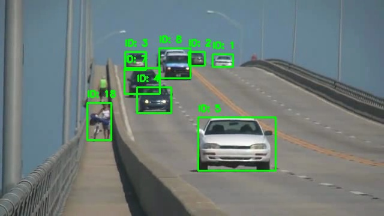
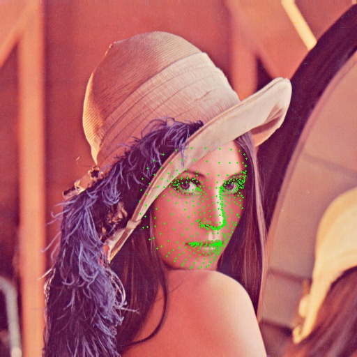

# 📷 OpenCV 6주차 과제 정리

본 저장소는 컴퓨터비전 OpenCV 6주차 과제(1~2)를 수행한 결과를 담고 있습니다.

---

## 📌 과제 1: SORT 알고리즘을 활용한 다중 객체 추적기 구현
`01_dynamic_vision_01.py`
SORT 알고리즘을 사용하여 비디오에서 다중 객체를 실시간으로 추적하는 과제입니다. YOLOv3 객체 검출기와 SORT 알고리즘(칼만 필터 + 헝가리안 알고리즘)을 결합하여 동영상 내 차량 등의 다중 객체를 검출하고 각각의 고유 ID를 부여하여 경계 상자와 함께 시각화합니다.

### 📝 전체 코드
```python
import cv2
import numpy as np
import sys
import os

# add L06 to path to import sort
sys.path.append(os.path.join(os.path.dirname(__file__), 'L06'))
from sort import Sort

def main():
    # Load YOLOv3 network
    net = cv2.dnn.readNet("L06/yolov3.weights", "L06/yolov3.cfg")
    layer_names = net.getLayerNames()
    
    # Check OpenCV version to use appropriate getUnconnectedOutLayers() return format
    try:
        output_layers = [layer_names[i - 1] for i in net.getUnconnectedOutLayers()]
    except:
        output_layers = [layer_names[i[0] - 1] for i in net.getUnconnectedOutLayers()]
        
    # Load coco.names
    with open("L06/coco.names", "r") as f:
        classes = [line.strip() for line in f.readlines()]
        
    # Open video
    cap = cv2.VideoCapture("L06/slow_traffic_small.mp4")
    if not cap.isOpened():
        print("Error opening video stream or file")
        return

    # Get video properties for writer
    frame_width = int(cap.get(cv2.CAP_PROP_FRAME_WIDTH))
    frame_height = int(cap.get(cv2.CAP_PROP_FRAME_HEIGHT))
    fps = cap.get(cv2.CAP_PROP_FPS)

    # Initialize SORT tracker
    tracker = Sort()

    # Define the codec and create VideoWriter object
    os.makedirs('results', exist_ok=True)
    out = cv2.VideoWriter('results/01_result.mp4', cv2.VideoWriter_fourcc(*'mp4v'), fps, (frame_width, frame_height))

    frame_idx = 0
    while cap.isOpened():
        ret, frame = cap.read()
        if not ret:
            break
            
        height, width, channels = frame.shape

        # Detecting objects
        blob = cv2.dnn.blobFromImage(frame, 0.00392, (416, 416), (0, 0, 0), True, crop=False)
        net.setInput(blob)
        outs = net.forward(output_layers)

        # Showing informations on the screen
        class_ids = []
        confidences = []
        boxes = []
        for out_det in outs:
            for detection in out_det:
                scores = detection[5:]
                class_id = np.argmax(scores)
                confidence = scores[class_id]
                if confidence > 0.5:
                    # Object detected
                    center_x = int(detection[0] * width)
                    center_y = int(detection[1] * height)
                    w = int(detection[2] * width)
                    h = int(detection[3] * height)

                    # Rectangle coordinates
                    x = int(center_x - w / 2)
                    y = int(center_y - h / 2)

                    boxes.append([x, y, w, h])
                    confidences.append(float(confidence))
                    class_ids.append(class_id)

        # apply Non-Max Suppression
        indexes = cv2.dnn.NMSBoxes(boxes, confidences, 0.5, 0.4)
        
        # Prepare info for SORT
        # Format for SORT: [x1, y1, x2, y2, score]
        dets = []
        if len(indexes) > 0:
            for i in indexes.flatten():
                x, y, w, h = boxes[i]
                dets.append([x, y, x + w, y + h, confidences[i]])
        
        dets = np.array(dets)
        if len(dets) == 0:
            dets = np.empty((0, 5))

        # Update tracker
        trackers = tracker.update(dets)

        # Draw tracking results
        for d in trackers:
            x1, y1, x2, y2, track_id = [int(v) for v in d]
            
            # Draw bounding box
            color = (0, 255, 0)
            cv2.rectangle(frame, (x1, y1), (x2, y2), color, 2)
            
            # Draw track ID
            text = f"ID: {track_id}"
            cv2.putText(frame, text, (x1, max(y1 - 10, 0)), cv2.FONT_HERSHEY_SIMPLEX, 0.5, color, 2)

        out.write(frame)
        
        # print progress
        if frame_idx % 10 == 0:
            print(f"Processed {frame_idx} frames")
        frame_idx += 1

    cap.release()
    out.release()
    print("Tracking completed. Output saved to results/01_result.mp4")

if __name__ == "__main__":
    main()
```

### 🔑 주요 코드 및 설명
```python
        # Prepare info for SORT
        # Format for SORT: [x1, y1, x2, y2, score]
        dets = []
        if len(indexes) > 0:
            for i in indexes.flatten():
                x, y, w, h = boxes[i]
                dets.append([x, y, x + w, y + h, confidences[i]])
                
        # Update tracker
        trackers = tracker.update(dets)
```
* **YOLOv3 객체 검출**: OpenCV의 `dnn` 모듈을 사용하여 YOLOv3의 사전훈련된 가중치와 구성 파일을 읽어 매 프레임별로 물체의 Bounding Box(`[x, y, w, h]`)를 생성합니다.
* **Non-Max Suppression**: 중복 검출된 영역을 제거하기 위해 `cv2.dnn.NMSBoxes`를 통해 필터링합니다. 
* **SORT 추적기 업데이트**: 검출기에서 나온 좌표 정보를 `[x1, y1, x2, y2, confidence]` 형식으로 변환하여 `tracker.update(dets)`에 전달합니다. SORT 추적기는 이전 프레임의 위치를 기반으로 ID를 유지시키며 데이터 연관을 수행하여 최종적으로 추적된 객체의 위치 정보와 고유 `track_id`를 반환합니다.

### 🖥 실행 결과 화면


*(출력된 원본 영상은 `results/01_result.mp4`에 저장되어 있습니다.)*

---

## 📌 과제 2: Mediapipe를 활용한 얼굴 랜드마크 추출 및 시각화
`02_dynamic_vision_02.py`
Mediapipe의 FaceMesh 모듈을 사용하여 얼굴의 468개 랜드마크를 추출하고, 이를 실시간 영상(웹캠 등)에 시각화하는 과제입니다.

### 📝 전체 코드
```python
import cv2
import mediapipe as mp
import os
import argparse

def main():
    parser = argparse.ArgumentParser()
    parser.add_argument('--test-mode', action='store_true', help='Run for a few frames and save a snapshot')
    args = parser.parse_args()

    mp_face_mesh = mp.solutions.face_mesh
    face_mesh = mp_face_mesh.FaceMesh(
        max_num_faces=1,
        refine_landmarks=True,
        min_detection_confidence=0.5,
        min_tracking_confidence=0.5
    )

    cap = cv2.VideoCapture(0)
    if not cap.isOpened():
        print("Cannot open webcam.")
        return

    os.makedirs('results', exist_ok=True)
    frame_count = 0
    saved = False

    print("Press ESC to exit...")

    while cap.isOpened():
        ret, frame = cap.read()
        if not ret:
            print("Failed to grab frame.")
            break

        # Flip the image horizontally for a later selfie-view display
        frame = cv2.flip(frame, 1)
        rgb_frame = cv2.cvtColor(frame, cv2.COLOR_BGR2RGB)

        # Process the frame
        results = face_mesh.process(rgb_frame)

        # Draw the face mesh annotations on the image.
        if results.multi_face_landmarks:
            for face_landmarks in results.multi_face_landmarks:
                for idx, landmark in enumerate(face_landmarks.landmark):
                    h, w, c = frame.shape
                    cx, cy = int(landmark.x * w), int(landmark.y * h)
                    cv2.circle(frame, (cx, cy), 1, (0, 255, 0), -1)

        cv2.imshow('MediaPipe FaceMesh', frame)

        # In test mode, save after a few frames to ensure webcam has adjusted
        if args.test_mode and frame_count == 30:
            cv2.imwrite('results/02_result.jpg', frame)
            print("Snapshot saved to results/02_result.jpg")
            saved = True
            break
        
        frame_count += 1

        if cv2.waitKey(1) & 0xFF == 27:
            break

    # If it wasn't test mode but we exit, let's still save the last frame if we haven't
    if not saved and frame is not None:
        cv2.imwrite('results/02_result.jpg', frame)
        print("Final frame saved to results/02_result.jpg")

    cap.release()
    cv2.destroyAllWindows()

if __name__ == '__main__':
    main()
```

### 🔑 주요 코드 및 설명
```python
        # Process the frame
        results = face_mesh.process(rgb_frame)

        # Draw the face mesh annotations on the image.
        if results.multi_face_landmarks:
            for face_landmarks in results.multi_face_landmarks:
                for idx, landmark in enumerate(face_landmarks.landmark):
                    h, w, c = frame.shape
                    cx, cy = int(landmark.x * w), int(landmark.y * h)
                    cv2.circle(frame, (cx, cy), 1, (0, 255, 0), -1)
```
* **Face Mesh 초기화**: `mp.solutions.face_mesh.FaceMesh` 모듈을 초기화하여 화면 상의 얼굴 위치를 찾고 복잡한 곡면 형태인 얼굴에 대한 468개 랜드마크를 반환할 수 있도록 설정합니다.
* **랜드마크 처리 및 변환**: 입력 BGR 이미지를 `cvtColor`를 통해 RGB 공간으로 변환한 뒤 `face_mesh.process()`의 입력값으로 전달합니다.
* **시각화 (Denormalization)**: 랜드마크 결과의 좌표(`landmark.x`, `landmark.y`)값은 이미지의 크기에 대해 0과 1사이로 정규화되어 있습니다. 따라서 이미지의 높이와 너비를 각각 곱해서 정수형태의 이미지상 위치 좌표로 바꾸어주고 `cv2.circle` 함수를 통해 초록색 점으로 시각화합니다. 
* **프로그램 종료**: OpenCV의 `waitKey(1)`를 사용해 키 입력을 대기하고, ESC(ASCII값 27)를 누를 경우 반복문을 탈출하여 자원을 해제합니다.

### 🖥 실행 결과 화면

*(웹캠 기반으로 실행 시 랜드마크 추출 결과가 위와 같이 나타납니다)*
